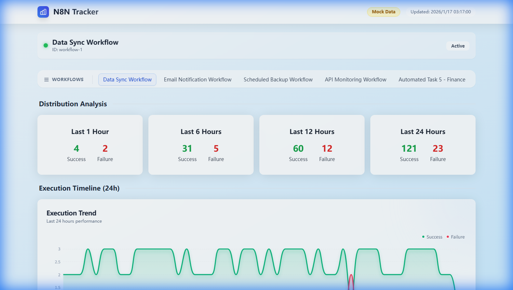
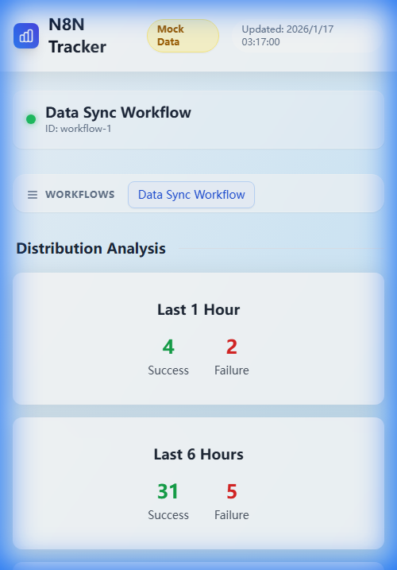

# N8N Workflow Execution Tracking Panel

## 🌐 Language Versions

- [English](README.md) (Current)
- [中文](docs/README-zh.md) (Chinese Version)

A workflow execution tracking panel built with Next.js + ECharts + Tailwind CSS for visualizing N8N workflow execution status.

## 🚀 Features

- ✅ **Workflow Selection**: Hover-expandable selection panel for seamless workflow switching with "Active Indicator"
- ✅ **Execution Statistics**: Display execution success/failure counts for last 1 hour, 6 hours, 12 hours, 1 day
- ✅ **Execution Trend**: 24-hour execution trend line chart with "Gradient Flow" design and auto-refresh without animation
- ✅ **Execution Distribution**: Glassmorphism-style pie chart showing execution result distribution
- ✅ **Multi-mode Support**: Support mock data mode, test mode, production mode
- ✅ **Real-time Data**: Fetch real execution data from N8N API
- ✅ **Docker Deployment**: Support one-click Docker deployment
- ✅ **Responsive Design**: Adapt to different screen sizes with a premium feel

## � Screenshots

### Desktop View



### Mobile View



## �️ Tech Stack

- **Frontend Framework**: Next.js 14.2.3 (App Router)
- **Visualization Library**: ECharts 5.4.3
- **Styling**: Tailwind CSS 3.4.3 with custom glassmorphism utilities
- **Typography**: Inter (Google Fonts)
- **State Management**: React 18.3.1
- **Configuration**: YAML
- **Build Tool**: Next.js Build
- **Deployment**: Docker + PM2

## 📦 Quick Start

### 1. Local Development

#### 1.1 Install Dependencies

```bash
npm install
```

#### 1.2 Configuration File

Copy and modify the configuration file:

```bash
# Ensure config directory exists
mkdir -p config
```

Edit `config/config.yaml` file:

```yaml
mode: mock  # Options: mock, test, production

mock:
  enabled: true

test:
  enabled: true
  baseURL: https://your-n8n-instance.com  # Replace with your N8N instance URL
  token: your-n8n-api-token  # Replace with your N8N API token
  workflow:
    id: your-workflow-id

production:
  enabled: true
  baseURL: https://your-n8n-instance.com
  token: your-production-token
  workflow:
    id: your-workflow-id
```

#### 1.3 Start Development Server

```bash
npm run dev
```

Access http://localhost:3000 to view the application.

### 2. Docker Deployment

#### 2.1 Using Docker Compose (Recommended)

```bash
# Build and start service
docker-compose up -d

# View logs
docker-compose logs -f

# Stop service
docker-compose down
```

#### 2.2 Using Docker Alone

```bash
# Build image
docker build -t n8n-tracker .

# Run container
docker run -d \
  --name n8n-tracker \
  -p 3000:3000 \
  -v ./config:/app/config \
  --restart unless-stopped \
  n8n-tracker
```

#### 2.3 Docker Configuration

- **Port Mapping**: `3000:3000`
- **Volume Mapping**: `./config:/app/config` (persistent configuration)
- **Restart Policy**: `unless-stopped`
- **Health Check**: Check application status every 30 seconds

## ⚙️ Configuration Instructions

### Configuration File

Configuration file is located at `config/config.yaml`, supporting three modes:

1. **mock mode**: Use mock data, no N8N instance required
2. **test mode**: Test environment, connect to test N8N instance
3. **production mode**: Production environment, connect to production N8N instance

### Environment Variables

Configuration can be overridden via environment variables:

| Environment Variable | Description | Default Value |
|---------------------|-------------|---------------|
| `NODE_ENV` | Running environment | `development` |

## 🏗️ Project Structure

```
├── app/                      # Next.js App Router
│   ├── api/                  # API routes
│   │   └── workflow/         # Workflow-related APIs
│   ├── components/           # React components
│   ├── data/                 # Test data generation
│   ├── globals.css           # Global styles
│   ├── layout.tsx            # Layout component
│   └── page.tsx              # Main page
├── config/                   # Configuration files
│   ├── config.yaml           # Main configuration file
│   └── types.ts              # Configuration types
├── tests/                    # Test files
├── docs/                     # Documentation
│   └── README-zh.md          # Chinese README
├── .dockerignore             # Docker ignore file
├── docker-compose.yml        # Docker Compose configuration
├── Dockerfile                # Dockerfile
├── next.config.js            # Next.js configuration
├── package.json              # Dependency configuration
├── tailwind.config.js        # Tailwind configuration
└── tsconfig.json             # TypeScript configuration
```

## 📊 API Documentation

### 1. Get Workflow List

```
GET /api/workflow/list
```

**Response**:
```json
{
  "mode": "test",
  "workflows": [
    {
      "id": "workflow-1",
      "name": "Data Sync Workflow",
      "active": true,
      "createdAt": "2025-12-13T12:25:34.928Z"
    }
  ]
}
```

### 2. Get Execution Data

```
GET /api/workflow/executions?workflowId={workflowId}
```

**Parameters**:
- `workflowId`: Optional, workflow ID for filtering execution data of specific workflow

**Response**:
```json
{
  "mode": "test",
  "stats": {
    "lastHour": {
      "name": "Last 1 Hour",
      "successCount": 10,
      "failureCount": 2
    }
  },
  "chartData": [
    {
      "time": "00:00",
      "success": 2,
      "failure": 0
    }
  ],
  "executions": [/* Execution records */]
}
```

## 📈 Data Visualization

### 1. Execution Result Distribution Pie Chart

- Display execution success/failure distribution across different time ranges
- Legend shows specific success/failure counts
- No animation effect, direct switching display

### 2. Execution Trend Line Chart

- 24-hour execution status with 30-minute intervals
- Green line: Success count
- Red line: Failure count
- Independent display, no stacking

## 🎯 Deployment Methods

### 1. Local Development

```bash
npm run dev
```

### 2. Production Build

```bash
npm run build
npm start
```

### 3. Docker Deployment

```bash
docker-compose up -d
```

### 4. PM2 Deployment

```bash
# Install PM2 globally
npm install -g pm2

# Build the application
npm run build

# Start application with PM2
pm2 start npm -- start

# Restart with PM2
pm2 restart n8n-tracker

# View logs
pm2 logs n8n-tracker

# Stop with PM2
pm2 stop n8n-tracker
```

#### PM2 Management Commands

```bash
# Check PM2 status
pm2 status

# Restart application
pm2 restart n8n-tracker

# View logs
pm2 logs n8n-tracker

# Stop application
pm2 stop n8n-tracker

# Delete application from PM2
pm2 delete n8n-tracker
```

#### PM2 Ecosystem Configuration

Create an `ecosystem.config.js` file:

```javascript
module.exports = {
  apps: [
    {
      name: 'n8n-tracker',
      script: 'npm',
      args: 'start',
      instances: 1,
      autorestart: true,
      watch: false,
      max_memory_restart: '1G',
      env: {
        NODE_ENV: 'production'
      }
    }
  ]
};
```

Then start with:

```bash
npm run build
pm2 start
```

## 🤝 Contribution Guidelines

1. Fork the repository
2. Create a feature branch (`git checkout -b feature/AmazingFeature`)
3. Commit your changes (`git commit -m 'Add some AmazingFeature'`)
4. Push to the branch (`git push origin feature/AmazingFeature`)
5. Open a Pull Request

## 📄 License

MIT License - See [LICENSE](LICENSE) file for details

## 📞 Contact

For issues or suggestions, please submit an [Issue](https://github.com/your-repo/n8n-tracker/issues).

## 🙏 Acknowledgments

- [N8N](https://n8n.io/) - Powerful automation workflow platform
- [Next.js](https://nextjs.org/) - Modern React framework
- [ECharts](https://echarts.apache.org/) - Excellent data visualization library
- [Tailwind CSS](https://tailwindcss.com/) - Utility-first CSS framework

---

**Enjoy using N8N Workflow Execution Tracking Panel!** 🎉